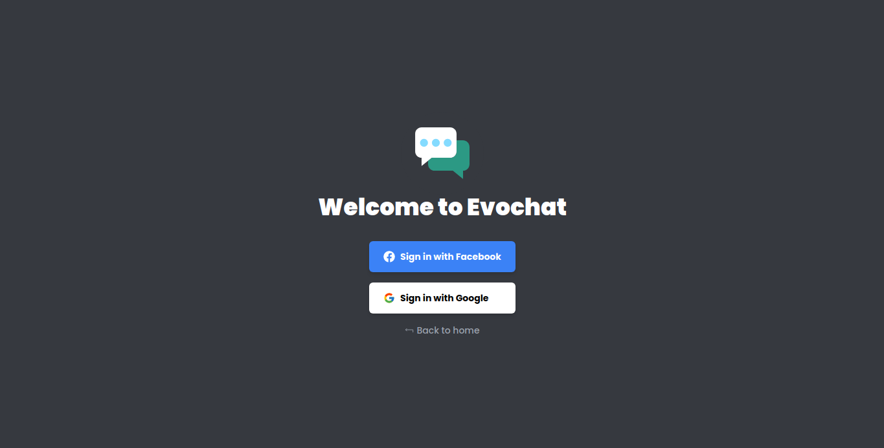
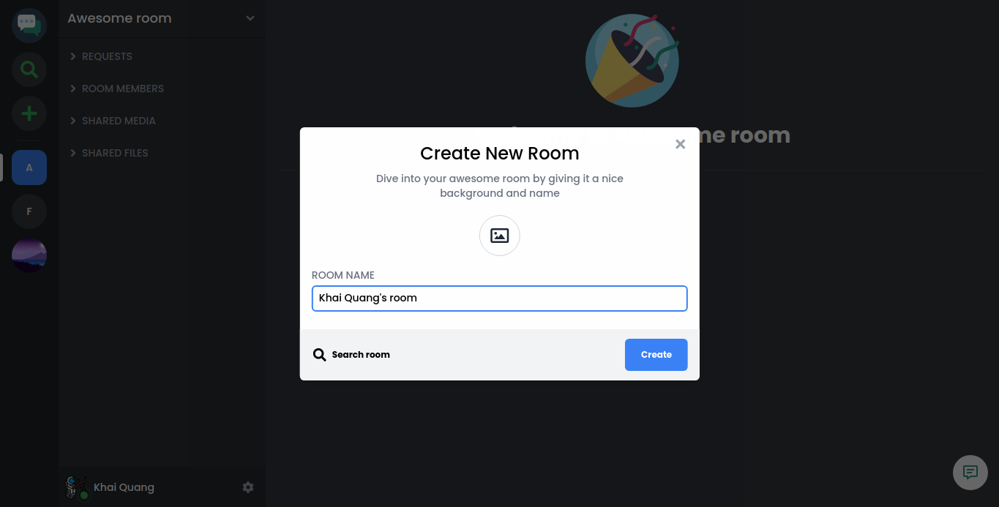
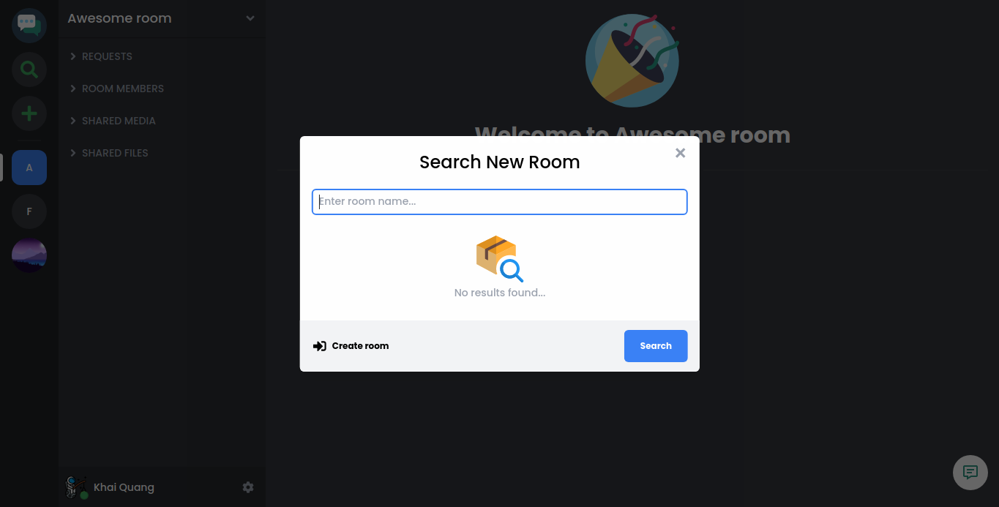
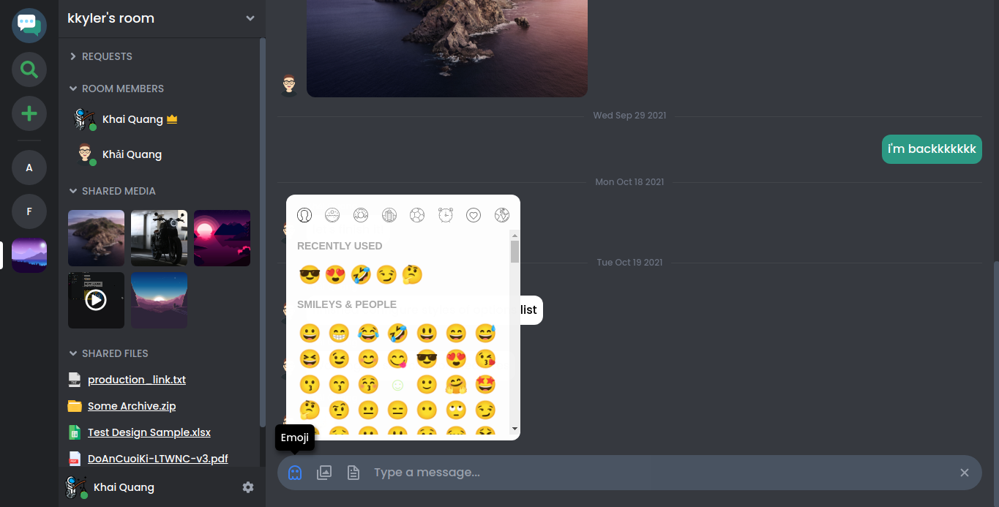
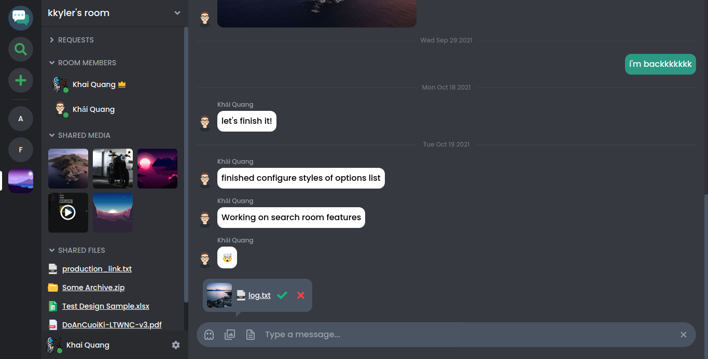

# Evochat

Evochat is my project in creating a realtime messaging network by ReactJS and Firebase features. A realtime connection between users in their joined rooms will be created by Firestore and all of the uploaded media and files are handled by Storage. Evochat's room provides users with basic types of sending message such as text, image, video and file. Besides, it also provides all information about owner, members, shared media, shared files and some other cool options.

> Evochat is still under development.

## Screenshots

### Home

### Sign in

### Create room

### Search room

### Features

